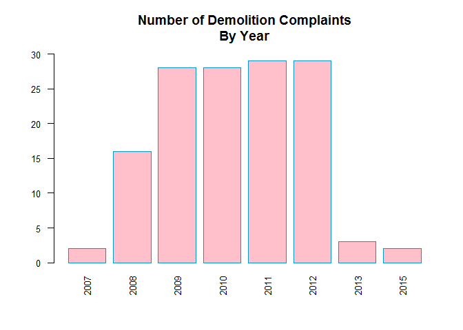
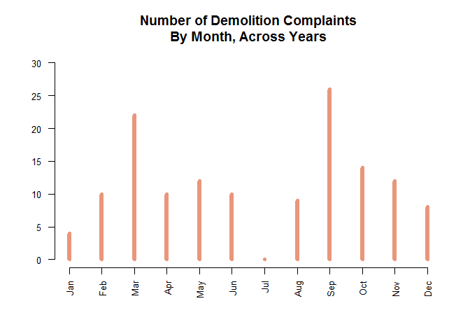
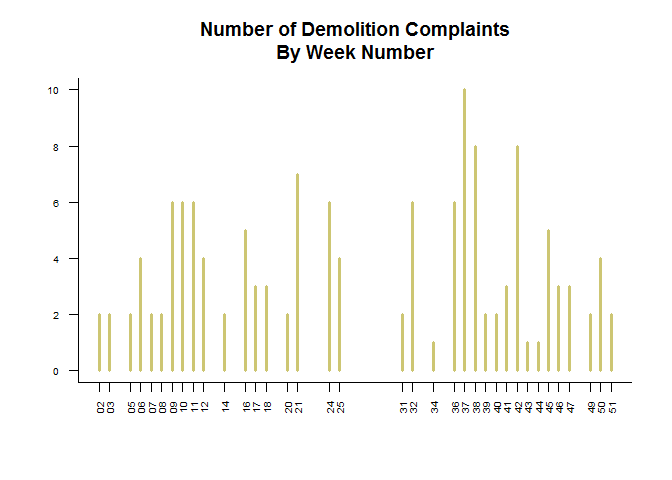
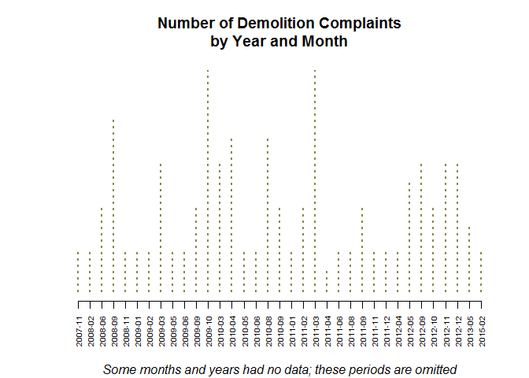
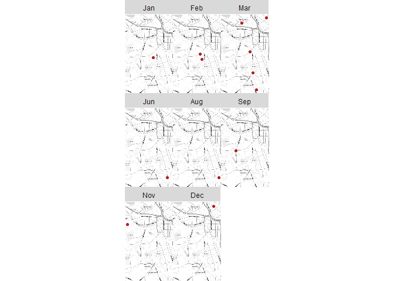

Lab 01 - Working with Dates
================
Francisco Santamarina
February 16, 2017

Load the necessary packages and dataset for questions 1 and 2.

``` r
library( dplyr )
library( ggmap )
library( pander )
```

#### 1. Follow the steps in the Dates tutoial to read in the code violation data and drop all variables except violation dates, violation types, and their coordinates (lat,lon).

``` r
dat <- read.csv( "https://raw.githubusercontent.com/lecy/code-orange/master/data/code%20violations.csv", stringsAsFactors = F )

dat <- dat[ , c( "Complaint.Type", "Violation.Date", "lat", "lon" ) ]
```

#### 2. Convert the Violation.Date from a character into a date class.

``` r
class( dat$Violation.Date  )
```

    ## [1] "character"

``` r
dat$Violation.Date <- as.Date( dat$Violation.Date, format = "%m/%d/%Y" )
```

#### 3. Create new variables for days of the week (Mon, Tues, Wed, etc.), weeks of the year (1-52), months, and years.

``` r
weekdays <- format( dat$Violation.Date, format = "%a"  )
days.order <- c( "Sun" , "Mon", "Tue", "Wed", "Thu", "Fri", "Sat" )
weekdays <- factor( weekdays, levels = days.order, ordered = T )
table( weekdays  ) %>% pander
```

<table style="width:58%;">
<colgroup>
<col width="8%" />
<col width="8%" />
<col width="8%" />
<col width="8%" />
<col width="8%" />
<col width="8%" />
<col width="8%" />
</colgroup>
<thead>
<tr class="header">
<th align="center">Sun</th>
<th align="center">Mon</th>
<th align="center">Tue</th>
<th align="center">Wed</th>
<th align="center">Thu</th>
<th align="center">Fri</th>
<th align="center">Sat</th>
</tr>
</thead>
<tbody>
<tr class="odd">
<td align="center">5</td>
<td align="center">8769</td>
<td align="center">11219</td>
<td align="center">11398</td>
<td align="center">10521</td>
<td align="center">9480</td>
<td align="center">35</td>
</tr>
</tbody>
</table>

``` r
week.count <- format( dat$Violation.Date, format = "%U" )

months.abbrev <- format( dat$Violation.Date, format = "%b" )
month.order <- c("Jan","Feb","Mar","Apr","May","Jun","Jul","Aug","Sep","Oct","Nov","Dec")
months.abbrev <- factor( months.abbrev, levels = month.order, ordered = T )

years <- format( dat$Violation.Date, format = "%Y" )

dat$Weekdays <- weekdays
dat$Week.Count <- week.count
dat$Months.Abbrev <- months.abbrev
dat$Years <- years
```

#### 4. Select a category of code violations other than bed bugs and create a new dataset with all other data dropped.

``` r
boom <- dat[ dat$Complaint.Type == "Demolition", ]
```

#### 5. Create graphs to demonstrate the patterns in violations when you aggregate by the new date variables you have created.

``` r
# YEARS
barplot( table( boom$Years), 
         main = "Number of Demolition Complaints\nBy Year", 
         ylim = c( 0, 30 ), 
         col="pink", 
         bor="deepskyblue3", 
         las = 2, 
         cex.names = 0.8,
         cex.axis = 0.8
        )
```



``` r
# MONTHS
plot( table( boom$Months.Abbrev ),
      main = "Number of Demolition Complaints\nBy Month, Across Years", 
      ylab = "",
      ylim = c(0,30),
      lwd = 6,
      las=2,
      cex.axis = 0.8,
      col = "darksalmon"
    )
```



``` r
# WEEKS
plot( table( boom$Week.Count ),
      main = "Number of Demolition Complaints\nBy Week Number", 
      ylab = "",
      ylim = c(0,10),
      lwd = 3,
      las=2,
      cex.axis = 0.65,
      col = "khaki3",
      bty = "l"
    )
```



``` r
# WEEKDAYS
barplot( table( boom$Weekdays ), 
         main = "Number of Demolition Complaints\nBy Weekday", 
         ylim = c( 0, 45 ), 
         col="darkorange", 
         bor="darkgreen", 
         las = 2, 
         cex.names = 0.8,
         cex.axis = 0.8
        )
```


``` r
# ACROSS YEARS AND MONTHS

year.month <- format( boom$Violation.Date, "%Y-%m" )    
plot( table( year.month ),
      main = "Number of Demolition Complaints\nby Year and Month",
      sub = "Some months and years had no data; these periods are omitted",
      font.sub = 3,
      yaxt = "n",
      ylab = "",
      xlab = "",
      #ylim = c(0,10),
      lty = 3,
      lwd = 2,
      las=2,
      cex.axis = 0.65,
      col = "khaki4"
      #bty = "l"
    )
```



#### 6. Select one year of data. Using the qmplot() function in the ggmap package, create a plot with one map for each month.

***FJS**: I had issues with getting maps to appear for months with blank data (?).*

``` r
new.boom <- levels(boom$Months.Abbrev)
boom$Months.Abbrev <- factor( boom$Months.Abbrev, levels = new.boom )
table(boom$Months.Abbrev)
```

    ## 
    ## Jan Feb Mar Apr May Jun Jul Aug Sep Oct Nov Dec 
    ##   4  10  22  10  12  10   0   9  26  14  12   8

``` r
syr.min.lat <-  42.96
syr.max.lat <-  43.12
syr.min.lon <- -76.25
syr.max.lon <- -76.05

boom <- boom[ boom$lat > syr.min.lat & boom$lat < syr.max.lat , ]
boom <- boom[ boom$lon > syr.min.lon & boom$lon < syr.max.lon , ]
boom <- boom[ boom$Years == "2011" , ]

qmplot( lon, lat, data = boom, maptype = "toner-lite", 
        color = I( "firebrick" ) ) + facet_wrap( ~ Months.Abbrev ) 
```


