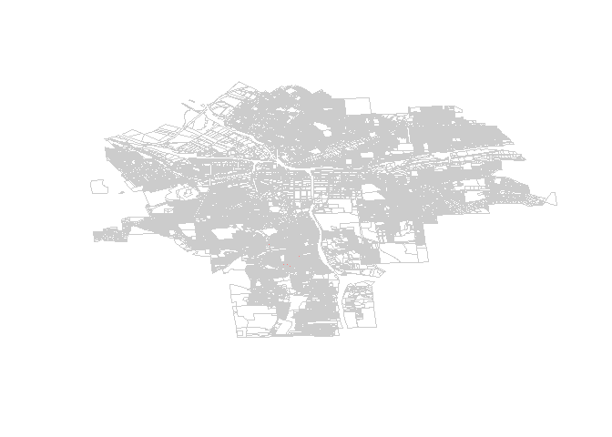
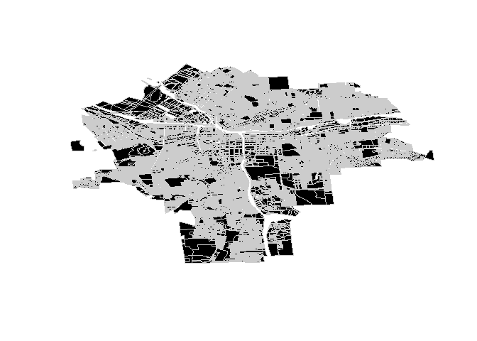

Lab 03 - Shapefiles week 1
================
Francisco Santamarina
February 16, 2017

Load the necessary packages and dataset for questions 1, 2, and 3.

``` r
#setwd( "//hd.ad.syr.edu/02/7796a1/Documents/Desktop/DDM/DDM II" )
#setwd("~/Graduate School/PAI 690 Independent Study_DDM II/Labs")

library( maptools )
library( sp )
library( dplyr )

#dir.create( "shapefiles" )
#setwd( "~/Desktop/DDM/DDM II/shapefiles" )
setwd("~/Graduate School/PAI 690 Independent Study_DDM II/Labs/shapefiles")
#download.file("ftp://ftp2.census.gov/geo/tiger/TIGER2010/TRACT/2010/tl_2010_36067_tract10.zip", "onondaga census tracts.zip" )
#unzip( "onondaga census tracts.zip" )
#file.remove( "onondaga census tracts.zip" )
dir()
```

    ## [1] "01-05-2015.dbf" "01-05-2015.prj" "01-05-2015.sbn" "01-05-2015.sbx"
    ## [5] "01-05-2015.shp" "01-05-2015.shx"

``` r
syr <- readShapePoly( fn="01-05-2015", 
         proj4string=CRS("+proj=longlat +datum=WGS84") )
#plot( syr,  border="gray80" )

dat <- read.csv( "https://raw.githubusercontent.com/lecy/maps-in-R/master/Data/syr_parcels.csv" )
tbl <- tbl_df(dat)
```

### Question 1: How many single family homes are in each neighborhood?

#### Create a table of the count of single family homes by neighborhood

``` r
sf.nhood <- table( dat$Nhood[dat$LandUse == "Single Family"])

#littletbl <- select(.data=tbl, Nhood, LandUse)
#glimpse(littletbl)

#arrange(summarise( group_by( Nhood,home.count ), home.count = sum( LandUse  ), desc( Nhood) )
                      
#summarise( .data=littletbl, sum(LandUse) )
#count(littletblLandUse)
```

#### Highlight all single family homes, using a different color for each neighborhood

``` r
col.nhood <- rainbow( 33, s = 1, v = 1, start = 0, end = 1, alpha = 0.5 )
unique.nhood <- unique(dat$Nhood)
unique.nhood <- sort(unique.nhood)
#table(col.nhood)

sf.nhood1 <- ifelse( dat$Nhood == unique.nhood[1] & dat$LandUse == "Single Family", col.nhood[1], NA )
sf.nhood2 <- ifelse( dat$Nhood == unique.nhood[2] & dat$LandUse == "Single Family", col.nhood[2], NA )
sf.nhood3 <- ifelse( dat$Nhood == unique.nhood[3] & dat$LandUse == "Single Family", col.nhood[3], NA )
sf.nhood4 <- ifelse( dat$Nhood == unique.nhood[4] & dat$LandUse == "Single Family", col.nhood[4], NA )
sf.nhood5 <- ifelse( dat$Nhood == unique.nhood[5] & dat$LandUse == "Single Family", col.nhood[5], NA )
sf.nhood6 <- ifelse( dat$Nhood == unique.nhood[6] & dat$LandUse == "Single Family", col.nhood[6], NA )
sf.nhood7 <- ifelse( dat$Nhood == unique.nhood[7] & dat$LandUse == "Single Family", col.nhood[7], NA )
sf.nhood8 <- ifelse( dat$Nhood == unique.nhood[8] & dat$LandUse == "Single Family", col.nhood[8], NA )
sf.nhood9 <- ifelse( dat$Nhood == unique.nhood[9] & dat$LandUse == "Single Family", col.nhood[9], NA )
sf.nhood10 <- ifelse( dat$Nhood == unique.nhood[10] & dat$LandUse == "Single Family", col.nhood[10], NA )
sf.nhood11 <- ifelse( dat$Nhood == unique.nhood[11] & dat$LandUse == "Single Family", col.nhood[11], NA )
sf.nhood12 <- ifelse( dat$Nhood == unique.nhood[12] & dat$LandUse == "Single Family", col.nhood[12], NA )
sf.nhood13 <- ifelse( dat$Nhood == unique.nhood[13] & dat$LandUse == "Single Family", col.nhood[13], NA )
sf.nhood14 <- ifelse( dat$Nhood == unique.nhood[14] & dat$LandUse == "Single Family", col.nhood[14], NA )
sf.nhood15 <- ifelse( dat$Nhood == unique.nhood[15] & dat$LandUse == "Single Family", col.nhood[15], NA )
sf.nhood16 <- ifelse( dat$Nhood == unique.nhood[16] & dat$LandUse == "Single Family", col.nhood[16], NA )
sf.nhood17 <- ifelse( dat$Nhood == unique.nhood[17] & dat$LandUse == "Single Family", col.nhood[17], NA )
sf.nhood18 <- ifelse( dat$Nhood == unique.nhood[18] & dat$LandUse == "Single Family", col.nhood[18], NA )
sf.nhood19 <- ifelse( dat$Nhood == unique.nhood[19] & dat$LandUse == "Single Family", col.nhood[19], NA )
sf.nhood20 <- ifelse( dat$Nhood == unique.nhood[20] & dat$LandUse == "Single Family", col.nhood[20], NA )
sf.nhood21 <- ifelse( dat$Nhood == unique.nhood[21] & dat$LandUse == "Single Family", col.nhood[21], NA )
sf.nhood22 <- ifelse( dat$Nhood == unique.nhood[22] & dat$LandUse == "Single Family", col.nhood[22], NA )
sf.nhood23 <- ifelse( dat$Nhood == unique.nhood[23] & dat$LandUse == "Single Family", col.nhood[23], NA )
sf.nhood24 <- ifelse( dat$Nhood == unique.nhood[24] & dat$LandUse == "Single Family", col.nhood[24], NA )
sf.nhood25 <- ifelse( dat$Nhood == unique.nhood[25] & dat$LandUse == "Single Family", col.nhood[25], NA )
sf.nhood26 <- ifelse( dat$Nhood == unique.nhood[26] & dat$LandUse == "Single Family", col.nhood[26], NA )
sf.nhood27 <- ifelse( dat$Nhood == unique.nhood[27] & dat$LandUse == "Single Family", col.nhood[27], NA )
sf.nhood28 <- ifelse( dat$Nhood == unique.nhood[28] & dat$LandUse == "Single Family", col.nhood[28], NA )
sf.nhood29 <- ifelse( dat$Nhood == unique.nhood[29] & dat$LandUse == "Single Family", col.nhood[29], NA )
sf.nhood30 <- ifelse( dat$Nhood == unique.nhood[30] & dat$LandUse == "Single Family", col.nhood[30], NA )
sf.nhood31 <- ifelse( dat$Nhood == unique.nhood[31] & dat$LandUse == "Single Family", col.nhood[31], NA )
sf.nhood32 <- ifelse( dat$Nhood == unique.nhood[32] & dat$LandUse == "Single Family", col.nhood[32], NA )
sf.nhood33 <- ifelse( dat$Nhood == unique.nhood[33] & dat$LandUse == "Single Family", col.nhood[33], NA )

sf.nhoods <- c( sf.nhood1, sf.nhood2, sf.nhood3, sf.nhood4, sf.nhood5, sf.nhood6, sf.nhood7, sf.nhood8, sf.nhood9,                      sf.nhood10, sf.nhood11, sf.nhood12, sf.nhood13, sf.nhood14, sf.nhood15, sf.nhood16, sf.nhood17,                         sf.nhood18, sf.nhood19, sf.nhood20, sf.nhood21, sf.nhood22, sf.nhood23, sf.nhood24, sf.nhood25,                         sf.nhood26, sf.nhood27, sf.nhood28, sf.nhood29, sf.nhood30, sf.nhood31, sf.nhood32, sf.nhood33
              )

plot( syr, border="gray80", col=sf.nhoods, oma=c(5,7,1,1) )
```



### Question 2: Where does land in Syracuse have the highest value?

#### Create a table of the count of single family homes with values above $200k in each neighborhood, as a pecentage of all single family homes

``` r
sf.rich.nhood <- table( dat$Nhood[dat$LandUse == "Single Family" &   
                           dat$AssessedVa > 200000]
                         ) 
#sf.rich.percent <- dat[ , c( "Nhood", "LandUse", "AssessedVa" ) ]
#sf.rich.percent <- sf.rich.percent$Nhood[ sf.rich.percent$LandUse == "Single Family" ]
#tbl <- table( sf.rich.percent$Nhood[sf.rich.percent$AssessedVa > 200000] )
tbl.srn <- sf.rich.nhood
cbind(tbl.srn,prop.table(tbl.srn))
```

    ##                         tbl.srn            
    ## Brighton                      0 0.000000000
    ## Court-Woodlawn                0 0.000000000
    ## Downtown                      0 0.000000000
    ## Eastwood                      1 0.003952569
    ## Elmwood                       0 0.000000000
    ## Far Westside                  0 0.000000000
    ## Franklin Square               0 0.000000000
    ## Hawley-Green                  0 0.000000000
    ## Lakefront                     0 0.000000000
    ## Lincoln Hill                  7 0.027667984
    ## Meadowbrook                  60 0.237154150
    ## Near Eastside                 0 0.000000000
    ## Near Westside                 0 0.000000000
    ## North Valley                  0 0.000000000
    ## Northside                     2 0.007905138
    ## Outer Comstock                3 0.011857708
    ## Park Ave.                     0 0.000000000
    ## Prospect Hill                 0 0.000000000
    ## Salt Springs                  0 0.000000000
    ## Sedgwick                    130 0.513833992
    ## Skunk City                    0 0.000000000
    ## South Campus                  0 0.000000000
    ## South Valley                  5 0.019762846
    ## Southside                     0 0.000000000
    ## Southwest                     0 0.000000000
    ## Strathmore                   16 0.063241107
    ## Tipp Hill                     0 0.000000000
    ## University Hill               1 0.003952569
    ## University Neighborhood      17 0.067193676
    ## Washington Square             0 0.000000000
    ## Westcott                      0 0.000000000
    ## Winkworth                    11 0.043478261

#### Plot the value / acre of all parcels in Syracuse

``` r
alv.acre <- mutate(.data = tbl, AssessedLa.acre = AssessedLa / Acres)

col.alv.acre <- cut( alv.acre$AssessedLa.acre, breaks = 5 )

plot( syr, border="gray80", col=col.alv.acre, oma=c(5,7,1,1) )
```



### Question 3: What is the age of single family homes in each neighborhood?

#### Create a table that reports the 10th, 25th, 50th, 75th, and 90th percentile of home ages in each neighborhood.

``` r
#sf.rich.nhood <- table( dat$Nhood[dat$LandUse == "Single Family" &   
#                           dat$AssessedVa > 200000]
#                         ) 
#sf.rich.percent <- dat[ , c( "Nhood", "LandUse", "AssessedVa" ) ]
#sf.rich.percent <- sf.rich.percent$Nhood[ sf.rich.percent$LandUse == "Single Family" ]
#tbl <- table( sf.rich.percent$Nhood[sf.rich.percent$AssessedVa > 200000] )
#tbl.srn <- sf.rich.nhood
#cbind(tbl.srn,prop.table(tbl.srn))

#quantile( sf.rich )
```

#### Create a choropleth map that shows the age of properties by decade, pre-1900s can be one category.

``` r
#sf.rich.nhood <- table( dat$Nhood[dat$LandUse == "Single Family" &   
#                           dat$AssessedVa > 200000]
#                         ) 
#sf.rich.percent <- dat[ , c( "Nhood", "LandUse", "AssessedVa" ) ]
#sf.rich.percent <- sf.rich.percent$Nhood[ sf.rich.percent$LandUse == "Single Family" ]
#tbl <- table( sf.rich.percent$Nhood[sf.rich.percent$AssessedVa > 200000] )
#tbl.srn <- sf.rich.nhood
#cbind(tbl.srn,prop.table(tbl.srn))

#quantile( sf.rich )
```
