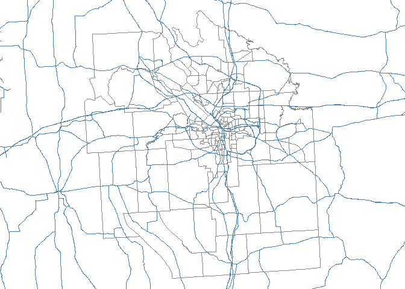
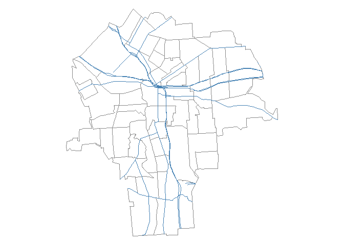
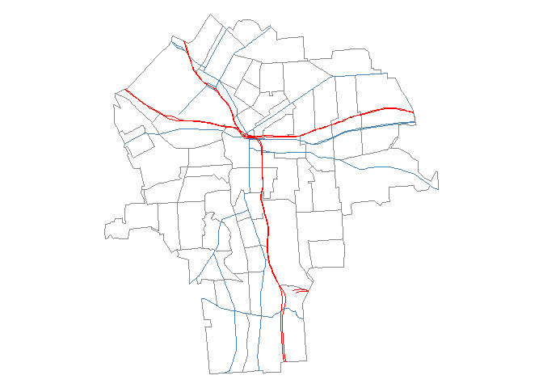
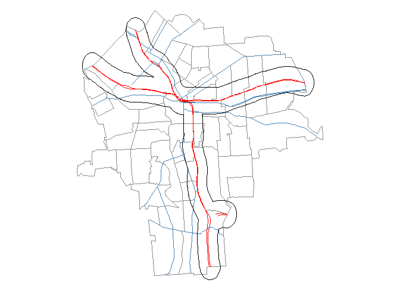
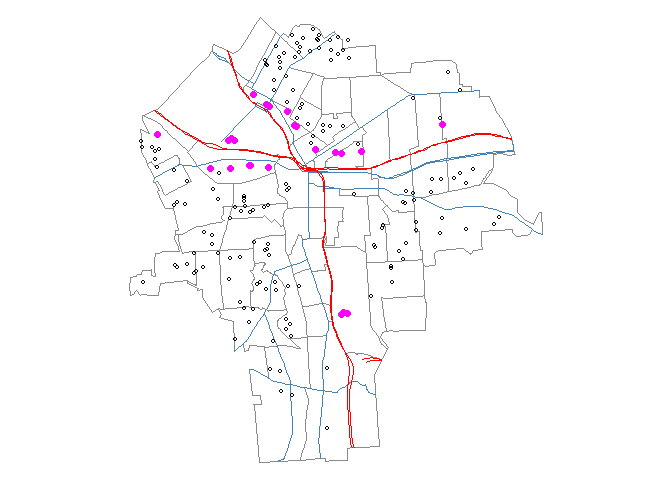
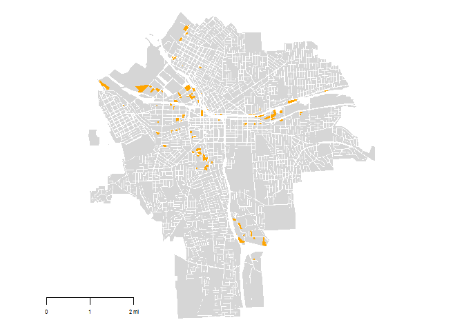
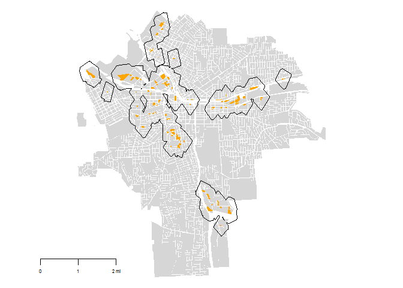
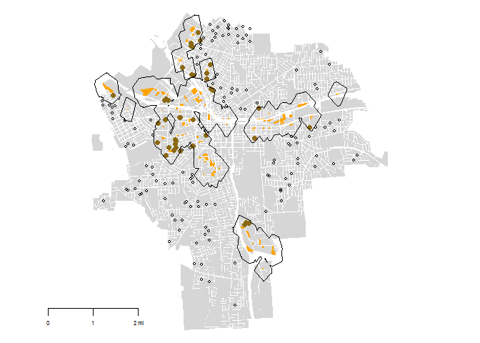
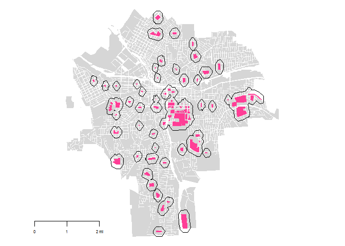
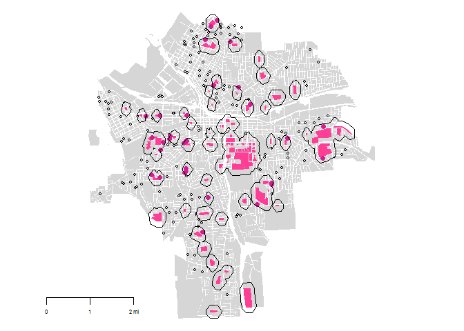

# Lab 06 - Creating Buffers
Francisco Santamarina  
March 09, 2017  


Load the necessary packages.

```r
library( geojsonio )
library( maps )
library( maptools )
library( measurements )
library( raster )
library( rgdal )
library( rgeos )
library( sp )
```

## Part 1: Tracts with TIGER Files

Load and clean the necessary dataset.

```r
# Set the working directory
setwd("~/Graduate School/PAI 690 Independent Study_DDM II/Labs/Lab 06_Buffers")
# dir.create( "shapefiles" )
setwd( "./shapefiles" )


## Download TIGER shapefiles - commented out because it was already completed

# download.file("ftp://ftp2.census.gov/geo/tiger/TIGER2010/TRACT/2010/tl_2010_36067_tract10.zip", "onondaga census tracts.zip" )
# unzip( "onondaga census tracts.zip" )
# file.remove( "onondaga census tracts.zip" )
# dir()


## Load TIGER shapefiles
syr <- readShapePoly( fn="tl_2010_36067_tract10", proj4string=CRS("+proj=longlat +datum=WGS84") )

## Add roads - loading commented out because it was already completed

# download.file("ftp://ftp2.census.gov/geo/tiger/TIGER2015/PRISECROADS/tl_2015_36_prisecroads.zip", "primary_and_secondary_roads.zip" )
# unzip( "primary_and_secondary_roads.zip" )
# file.remove( "primary_and_secondary_roads.zip" )
# dir()

roads <- readShapeLines( fn="tl_2015_36_prisecroads", proj4string=CRS("+proj=longlat +datum=WGS84") )
# RTTYP = Road Type Code
# C = county
# I = interstate
# M = Common Name
# O = other
# S = state recognized
# U = U.S.

# Plot the shapefile and roads to check your progress
par( mar=c(0,0,0,0) )
plot( syr,  border="gray54" )
plot( roads, col="steelblue", lwd=1, add=T )
```

<!-- -->

#### Create a polygon outline

```r
# Plot only the tracts within the city
# 0 or 1 in the 7th position of the FIPS ID string seem to differentiate city vs rural
# OR only looking at the last 4 is insufficient for a 3-digit census tract ID

syr <- syr[ (as.numeric(substr(syr$GEOID10, 7,11)) < 06200 ) & (as.numeric(substr(syr$GEOID10, 7,11)) > 0), ]
```


#### Clip or Crop Roads down to same size as census tracts

```r
# You can use gClip() to do a modified subsetting of geospatial points/lines
# http://robinlovelace.net/r/2014/07/29/clipping-with-r.html
# This returns a BOX that has the roads limited within it
# Clip is computationally expensive, has to determine what to do with the polygons destroyed in the clip

# Use intersect instead of gClip and syr.sub
# source: https://gis.stackexchange.com/questions/23931/how-to-intersect-lines-and-polygons-in-r
# author: xhie                library( raster )
# raster::intersect is a way to access intersect within package raster; it loads the package without attaching it.
roads.cropped <- intersect( roads, syr )

# Plot the polygon outline and cropped roads to check your progress
par( mar=c(0,0,0,0) )
plot( syr,  border="gray54" )
plot( roads.cropped, col="steelblue", lwd=1, add=T )
```

<!-- -->


#### Extract the interstates as a separate layer

```r
interstate <- roads.cropped[ roads.cropped$RTTYP == "I", ]
interstate <- intersect( interstate, syr )

# Plot the interstates to check your progress
par( mar=c(0,0,0,0) )
plot( syr,  border="gray54" )
plot( roads.cropped, col="steelblue", lwd=1, add=T )
plot( interstate, col="red", add=T )
```

<!-- -->

#### Create a buffer of approximately a quarter mile from the interstate

```r
# This is an approximate buffer; an accurate buffer requires a projection via UTM, Zone 18 for Syracuse/New York
buffhwy <- gBuffer(
  interstate,
  width = 0.005, # width of buffer
  byid = FALSE # applied across "subgeometries"   If you do FALSE, will automatically create a dissolved buffer
)
# To make accurate buffers, use a variant of this code.
# Units: https://gis.stackexchange.com/questions/85300/units-of-gbuffer-from-rgeos-package
# Projection to use: https://www.nceas.ucsb.edu/~frazier/RSpatialGuides/OverviewCoordinateReferenceSystems.pdf
# See the commented version of this code on GitHub for an example


# Plot the buffer to check your progress
par( mar=c(0,0,0,0) )
plot( syr,  border="gray54" )
plot( roads.cropped, col="steelblue", lwd=1, add=T )
plot( interstate, col="red", add=T )
plot( buffhwy, add=T)
```

<!-- -->

#### Identify all houses that fall within the buffer zone

```r
zdat <- read.csv( "https://raw.githubusercontent.com/R-Class/all-labs-ddmii-fjsantam/master/Lab%2006/zillowdata.csv" )
# For the code used to generate the raw CSV file above, refer to Lab_06_-_Geocoding_CSV_Script_FJS.Rmd in the Lab 06 folder on GitHub

# Convert the coordinates that are in lon (x) lat(y) order to spatial points, identifying the coordinates, data, and coordinate system
zcoor <- zdat[ c( "lon", "lat") ]
spdat <- SpatialPointsDataFrame( zcoor, zdat, proj4string=CRS("+proj=longlat +datum=WGS84")  )

# Function is: over( locations, layer )
homes.on.highway <- over( spdat, buffhwy )

# Create a categorical variable to identify if the house is in the dataset or not
# honh = "house on highway"
honh.logical <- as.character(homes.on.highway) != "NA"
honh.logical[ is.na(honh.logical) ] <- FALSE
```


#### Add a new categorical variable to the houses dataset: within buffer zone or not?

```r
# Bind the categorical variable to the original dataframe
dat.buffer <- cbind( zdat, honh.logical )

# Subset the dataframe to create a vector that only contains houses that are on the highway
dat.hwy.buffer <- dat.buffer[ dat.buffer$honh.logical == TRUE, ]
```


#### Compile the Map

```r
par( mar=c(0,0,0,0) )
plot( syr,  border="gray54" )
plot( roads.cropped, col="steelblue", lwd=1, add=T )
plot( interstate, col="red", add=T )
points( spdat, cex = 0.5 )
points( x=dat.hwy.buffer$lon, y=dat.hwy.buffer$lat, pch=19, col="magenta" )
```

<!-- -->


## Part 2: Parcels with GeoJSON Files

#### Create a buffer a quarter mile from industrial zones (LandUse) and plot the buffer zone


```r
# Set the working directory
setwd("~/GitHub/all-labs-ddmii-fjsantam/Lab 06")


## Download GeoJSON shapefiles - commented out because it was already completed

#dir.create( "shapefiles" )
#setwd( "./shapefiles" )
# download.file("https://github.com/lecy/geojson/raw/master/syr_parcels.geojson", "syr_parcels.geojson" )
# dir()


######## Shout out to Christopher Davis and his code
# Load the shapefile
syr2 <- readOGR( dsn = "shapefiles/syr_parcels.geojson" )
```

```
## OGR data source with driver: GeoJSON 
## Source: "shapefiles/syr_parcels.geojson", layer: "OGRGeoJSON"
## with 41502 features
## It has 64 fields
```

```r
# Identify the industrial parcels
landUseInd <- syr2[ syr2$LandUse == "Industrial", ]
landUseNotInd <- syr2[ syr2$LandUse != "Industrial", ]


# Plot the parcels that are and are not for Industrial Use to check your progress
par( mar = c( 0, 0, 0, 0 ) )
plot( landUseNotInd, col = "grey84", border = F )
plot( landUseInd, col = "orange", border = F, add = T )
map.scale( metric=F, ratio=F, relwidth=0.15, cex=0.5)
```

<!-- -->

##### Creating Buffers

```r
# This is an approximate buffer; an accurate buffer requires a projection via UTM, Zone 18 for Syracuse/New York

buffindzone <- gBuffer(
  landUseInd,
  width = 0.003621,
  capStyle = "FLAT",
  quadsegs = 1,
  byid = FALSE # applied across "subgeometries"   If you do FALSE, will automatically create a dissolved buffer
)


# Plot the buffer to check your progress
par( mar = c( 0, 0, 0, 0 ) )
plot( landUseNotInd, col = "grey84", border = F )
plot( landUseInd, col = "orange", border = F, add = T )
plot( buffindzone, add=T )
map.scale( metric=F, ratio=F, relwidth=0.15, cex=0.5)
```

<!-- -->


##### Identify houses within the buffer zones and create a categorical variable in the dataset indicating proximity to industrial zones

```r
# Transform the buffer to the same CRS as the Zillow data in spdat above so that they can be overlaid
buffindzone <- spTransform( buffindzone, CRS( "+proj=longlat +datum=WGS84" ) )

# Function is: over( locations, layer )
homes.in.ind <- over( spdat, buffindzone )

# Create a categorical variable to identify if the house is in the dataset or not
# hini = "house in industrial"

hini.logical <- as.character(homes.in.ind) != "NA"
hini.logical[ is.na(hini.logical) ] <- FALSE


############# Add to the dataset #############

# Bind the categorical variable to the original dataframe
dat.buffer <- cbind( dat.buffer, hini.logical )

# Subset the dataframe to create a vector that only contains houses that are in industrial buffers
dat.ind.buffer <- dat.buffer[ dat.buffer$hini.logical == TRUE, ]


# Plot the map, overlaying roads, houses, and houses within the industrial zones
par( mar=c(0,0,0,0) )
plot( landUseNotInd, col = "grey84", border = F )
plot( landUseInd, col = "orange", border = F, add = T )
points( x=spdat$lon, y=spdat$lat, cex = 0.5, pch=1 #col = "grey" 
       )
points( x=dat.ind.buffer$lon, y=dat.ind.buffer$lat, pch=19, col="goldenrod4" )
plot( buffindzone, add=T )
map.scale( metric=F, ratio=F, relwidth=0.15, cex=0.5)
```

<!-- -->

#### Create a buffer zone an eighth of a mile from schools, and plot the buffer zone.

```r
# Identify the school parcels
landUseSchool <- syr2[ syr2$LandUse == "Schools", ]
landUseNotSchool <- syr2[ syr2$LandUse != "Schools", ]

# Create the approximate buffer
buffschzone <- gBuffer(
  landUseSchool,
  width = 0.0018105,
  capStyle = "FLAT",
  quadsegs = 1,
  byid = FALSE # applied across "subgeometries"   If you do FALSE, will automatically create a dissolved buffer
)


# Plot the parcels that are and are not for School Use and the buffer to check your progress
par( mar=c(0,0,0,0) )
plot( landUseNotSchool, col = "grey84", border = F )
plot( landUseSchool, col = "violetred1", border = F, add = T )
plot( buffschzone, add=T )
map.scale( metric=F, ratio=F, relwidth=0.15, cex=0.5)
```

<!-- -->

#### Identify houses within the buffer zones and create a categorical variable in the dataset indicating proximity to schools

```r
# Transform the buffer to the same CRS as the Zillow data in spdat above so that they can be overlaid
buffschzone <- spTransform( buffschzone, CRS( "+proj=longlat +datum=WGS84" ) )

# Function is: over( locations, layer )
homes.in.sch <- over( spdat, buffschzone )

# Create a categorical variable to identify if the house is in the dataset or not
# hins = "house in school"

hins.logical <- as.character(homes.in.sch) != "NA"
hins.logical[ is.na(hins.logical) ] <- FALSE


############# Add to the dataset #############

# Bind the categorical variable to the original dataframe
dat.buffer <- cbind( dat.buffer, hins.logical )

# Subset the dataframe to create a vector that only contains houses that are in school buffers
dat.sch.buffer <- dat.buffer[ dat.buffer$hins.logical == TRUE, ]


# Plot the map, overlaying roads, houses, and houses within the school zones
par( mar=c(0,0,0,0) )
plot( landUseNotSchool, col = "grey84", border = F )
plot( landUseSchool, col = "violetred1", border = F, add = T )
points( x=spdat$lon, y=spdat$lat, cex = 0.5, pch=1 #col = "grey" 
       )
points( x=dat.sch.buffer$lon, y=dat.sch.buffer$lat, pch=19, col="violetred" )
plot( buffschzone, add=T )
map.scale( metric=F, ratio=F, relwidth=0.15, cex=0.5)
```

<!-- -->
